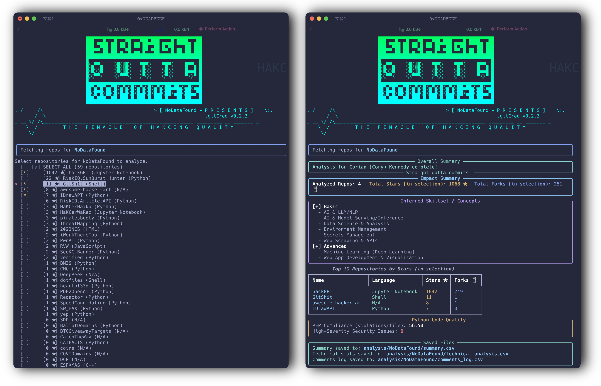
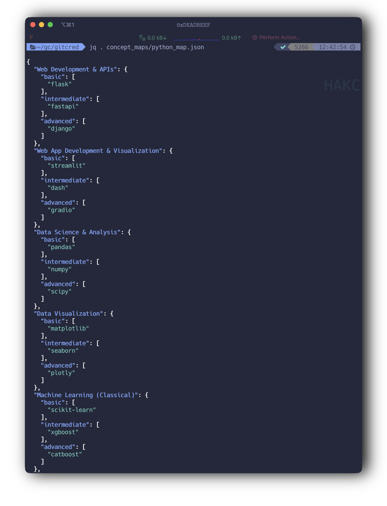

```
                         ▄▄▄▄▄▄▄▄▄▄▄▄▄▄▄▄▄▄▄▄▄▄▄▄▄▄▄▄▄▄▄▄▄▄▄▄▄▄▄▄▄
                         ███ ▄▄█▄ ▄█ ▄▄▀█ ▄▄▀██▄███ ▄▄▄█ ████▄ ▄██
                         ███▄▄▀██ ██ ▀▀▄█ ▀▀ ██ ▄██ █▄▀█ ▄▄ ██ ███
                         ███▄▄▄██▄██▄█▄▄█▄██▄█▄▄▄██▄▄▄▄█▄██▄██▄███
                         █▀▀▀▀▀▀▀▀▀▀▀▀▀▀▀▀▀▀▀▀▀▀▀▀▀▀▀▀▀▀▀▀▀▀▀▀▀▀▀█
                         █░▄▀▀▄    ░█░▒█░   ▀█▀░    ▀█▀░    █▀▀▄ █
                         █░█░░█    ░█░▒█░   ░█░░    ░█░░    █▄▄█ █
                         █░░▀▀░    ░░▀▀▀░   ░▀░░    ░▀░░    ▀░░▀ █
                         █▄▄▄▄▄▄▄▄▄▄▄▄▄▄▄▄▄▄▄▄▄▄▄▄▄▄▄▄▄▄▄▄▄▄▄▄▄▄▄█
                         ██▀▄▀█▀▄▄▀█░▄▀▄░█░▄▀▄░█░▄▀▄░██▄██▄░▄█░▄▄█
                         ██░█▀█░██░█░█▄█░█░█▄█░█░█▄█░██░▄██░██▄▄▀█
                         ███▄███▄▄██▄███▄█▄███▄█▄███▄█▄▄▄██▄██▄▄▄█
                         ▀▀▀▀▀▀▀▀▀▀▀▀▀▀▀▀▀▀▀▀▀▀▀▀▀▀▀▀▀▀▀▀▀▀▀▀▀▀▀▀▀
.:/=====/\=======================================> [ NoDataFound - P R E S E N T S ] ===\:.
 _ __  /  \________________________________________________________.gitCred v0.2.3 _ ___ _ 
_ __ \/ /\_____________________________________________________ _________ __ _______ _  
    \  /         T H E   P I N A C L E    O F   H A K C I N G   Q U A L I T Y  
     \/ 
```

[](https://www.python.org/)
[](https://streamlit.io/)
[](#)
[](#)
[](#)
[](#)

# GitCred: Straight Outta Commits




# GitCred: Straight Outta Commits Overview

`GitCred: Straight Outta Commits` aims to provide insight into skillset by performing analysis on a GitHub user's profile (or any code repos, local files, etc... ) to generate a comprehensive, evidence-based skill and impact summary by inspecting their original repositories (not forks). Purposely does not leverage AI models so you can build your own concept mapping. Trust but verify.

## Resume Builder Use Cases

- **Automated, Evidence-Based Resume Generation**
  - Instantly produces a skills matrix built from your actual code commits, not self-reported fluff
  - Surfaces real proficiency in frameworks, languages, and coding paradigms by parsing live repositories and identifying libraries, patterns, and toolchains
  - Generates impact summaries such as "Led original React microservice migration" or "Contributed to three security-focused Python projects," with a real audit trail

- **Skill Gap Identification and Growth Tracking**
  - Pinpoints which technologies you have genuinely mastered versus those with minimal exposure
  - Visualizes your coding evolution, for instance, "Progressed from procedural scripting to OOP Python over two years"

- **Showcasing Breadth and Depth for Recruiters**
  - Produces a portfolio map demonstrating both coverage and context, such as "Built Flask APIs," "Unit-tested with pytest," or "Deployed with Docker Compose"
  - One-click export for recruiters, yielding a skills dossier based on reality

## Analytical Use Cases

- **Threat Hunter or CTI Validation**
  - Profile open source contributors for red or blue team capabilities by examining their public artifacts, not just their LinkedIn headlines
  - Triage potential hires, contributors, or even threat actors by the code they have written and committed
  - Map contributors’ expertise to threat vectors. Example: "This candidate has authored kernel drivers and fuzzers, signaling low-level system exploit skills"

- **Due Diligence and Mergers or Acquisitions**
  - Rapidly assess the technical depth of engineering teams pre-acquisition or partnership by scanning public repository histories
  - Identify star contributors whose work is critical to business continuity

- **Technical Risk Assessment**
  - Map dependencies and stack choices across all repos to spot outdated libraries, deprecated tools, or lurking supply chain risks
  - Generate exposure matrices such as "Organization X has five production apps running unpatched Flask versions on Python 3.6"

- **Red Team Reconnaissance**
  - Target open source contributors with specific strengths or weaknesses. For example, "JavaScript codebase is all vanilla, lacks modern framework expertise," allowing for custom engagement
  - Build a real skills graph for a developer community to plan infiltration or knowledge transfer operations

## Self-Improvement and Team Analysis

- **Individual Skill Development**
  - Use your GitCred report to discover gaps in your portfolio and chart a learning plan with objective data
  - Set specific growth targets like "Move from intermediate to advanced in cloud automation" by tracking your evolving toolchain

- **Team/Org Capability Mapping**
  - Aggregate reports for all team members to build a real skills inventory. Visualize strengths, blind spots, and opportunities for training
  - Use for succession planning, incident response preparation, or hackathon team formation based on provable capabilities

**Example:**
_A security team uses GitCred to verify who can handle rapid Python refactoring, or who has proven experience with advanced logging, cryptography, or supply chain risk detection. The CTO builds a heatmap of org strengths before launching a cloud migration or major audit._

## Making Your Own Concept Map Template

GitCred is modular and extensible. You can define custom skill mappings for any language, stack, or internal framework.

### Step-by-Step: Adding Your Own Concept Map

1. **Navigate to the `concept_maps/` directory.**
2. **Create a new file** for your language or tech, such as `go_map.json` or `internalsec_map.json`
3. **Use the following template structure:**

   ```json
   {
     "Category 1": {
       "basic": [ "library1", "library2" ],
       "intermediate": [ "library3" ],
       "advanced": [ "library4" ]
     },
     "Category 2": {
       "basic": [ "libA" ],
       "intermediate": [ "libB" ],
       "advanced": [ "libC" ]
     }
   }
    ```

4. **Ensure the filename matches the language name from GitHub, all lowercase, and ends in `_map.json`.** For example, `javascript_map.json`.

5. **Update or create a corresponding analyzer** in the `analyzers/` directory for your language, or extend an existing one to recognize your new concept map and parse dependencies or frameworks accordingly.

6. **Register your new analyzer** in the main analyzer dispatch map (`main_analyzer.py`), by adding an entry in the form:

   ```python
   LANGUAGE_TO_ANALYZER_MAP = {
       "YourLanguage": YourLanguageAnalyzer,
       ...
   }
   ```

7. **Test your new mapping** by running the CLI or Streamlit app on a repo using your target language or tech.



### Pro Tips

* You can categorize skills by framework, paradigm, security level, or any other taxonomy. Make it as broad or as granular as your use case demands.
* You can fork and adapt the Python template to onboard new languages, or even create org-specific skill maps for custom tools.

## Setup

## API Key: Optional but Recommended
- **Without a key**: You use GitHub's anonymous access (rate limit: ~60 requests/hour).
- **With a key**: Your rate limit increases to 5,000 requests/hour.

If you want to use the github API, add the following to your `.env`

```bash
GITHUB_TOKEN="YourGitHubPersonalAccessToken"
```


Either run 
```bash
chmod +755 gitcred_installer.sh
./gitcred_installer.sh
```

or manually create the virtual environment and install dedendancies.

```bash
python3 -m venv gitcredvenv
source gitcredvenv/bin/activate
pip install --quiet --upgrade pip
pip install --quiet -r requirements.txt
```

## Usage

Activate the virtual environment, then choose your mode.
```
source gitcredvenv/bin/activate
```
**CLI:**

```bash
python gitcred_cli.py -u <github_username>
# or for file based bulk lookup for multiple users:
python gitcred_cli.py -f <file with usernames>
# or for multiple users:
python gitcred_cli.py -u user1 user2
# or analyze local repository:
python gitcred_cli.py -l /path/to/local/repo
```

All output and summary files are saved under the `analysis/` directory per user or repo.

<table align="center">
  <tr>
    <td align="center"></td>
    <td align="center"></td>
  </tr>
</table>


## Summary

GitCred’s modular pipeline validates skills, pinpoints strengths, exposes weaknesses, and helps you or your team make data-driven talent, security, or business decisions. For hackers, threat hunters, and recruiters, it is like scanning a target’s badge and getting their actual clearance, not just what is written in marker.

If you want receipts, GitCred brings receipts.
